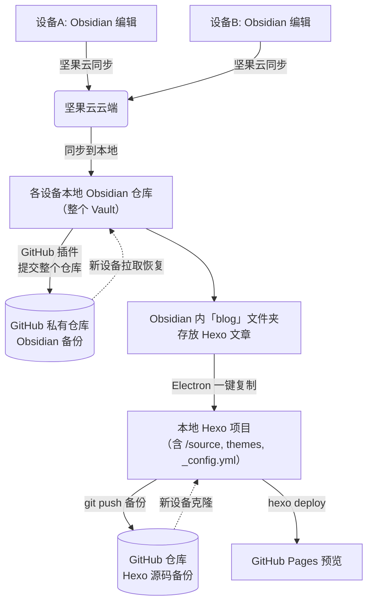

原本想着是用 node 脚本实现 Obsidian 的文章复制到 blog 项目中, 在 deploy 到 github page 上. 脑子一热, 想着多此一举的用 electron 可视化页面操作. 干脆 Vibe Coding 一下, 发现效果似乎不错.

> PS: 本篇文章就是用 electron 写的 Avan Toolkit 实现一键同步, 具体内容等完善后上传到 github 上面在更新这个文章

